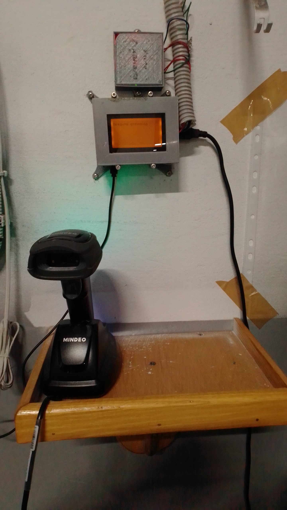

Данный проект позволят решить проблему вывоза с склада, в то время когда кладовщик отсутствует. 
Без сканирования штрихкода продукции программа не дает открыть ворота, чтобы вывезти продукцию с склада. 
Вся информация по роликам уходит в ERP систему, расширение для 1с есть в репрозитории.

В проекте существует следующая структура модулей:

- `json` — библиотека для парсинга и вывода JSON;
- `json_reader` — выполняет разбор JSON-данных полученных товаров и настроек 
- `transport_package` - в модуле хранится структура, методы для сохранения и отправки транспортных пакетов
- `xserial` - библиотека для работы с COM-портом, в данном проекте используется для подключения сканера штрихкодов
- `elevator_control` - основной класс содержит список товаров и их штрихкода
- `main` — точка входа в приложение
- `display` - библиотека для вывода информации на дисплей

При запуске программа считывает данные из полученного по http с сервера JSON файла с штрихкодами.
При начале работы лифт блокируется для открытия.

Оператор которому нужно открыть лифт последовательно считывает штрихкоды продукции которые необходимо отгрузить с склада.
На дисплее после каждого считывания высвечивается название позиции.
При считывании служебного штрихкода 9999999999999 лифт разблокируется на 10 минут и данные передаются на HTTP-сервер.
По истичении срока на двери подается сигнал для закрытия.
Если список пуст тогда выходит надпись, о том что отправлять нечего.
Затем выходит надпись введите штрихкод.
Платформа одноплатный компьютер. В данном проекте использовалась [REPKA-PI-3](https://repka-pi.ru/)
Переферия сканер штрихкодов, 2-х строчный индикатор, реле для нажатия на кнопки лифта.

Для сборки используется CMAKE.

При сборке, если используется дисплей и управление лифтом необходимо использовать переменную EXTERNAL_DISPLAY.

В программе создаются логи в корне с именем elevator_control.log. После достижения размера 5Мб данные архивируются и создается новый файл.

### При разработке использовались библиотеки:

Для работы сборки необходимо установить вот эту библиотеку [log4cpp](https://github.com/log4cpp/log4cpp)
Библиотека для работы с COM-портом [xserial](https://gith11ub.com/NewYaroslav/xserial/tree/master)
